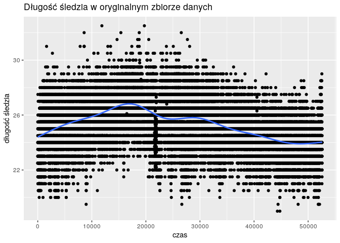
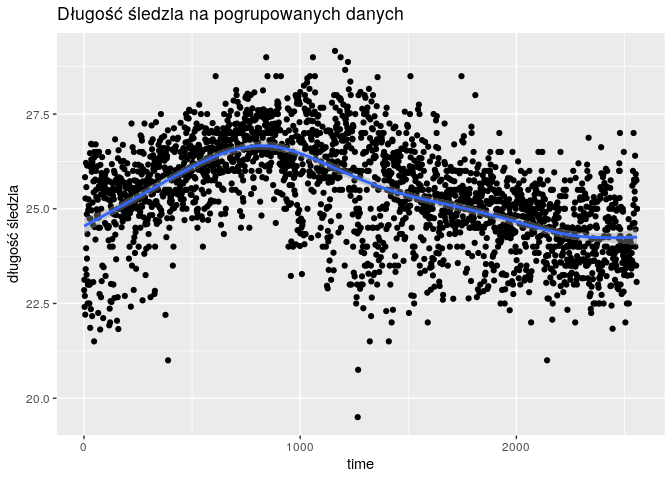
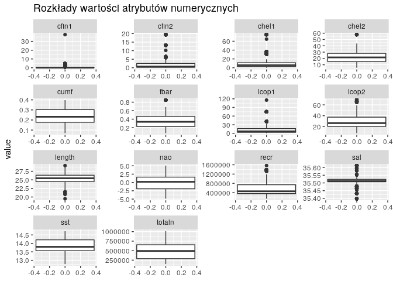
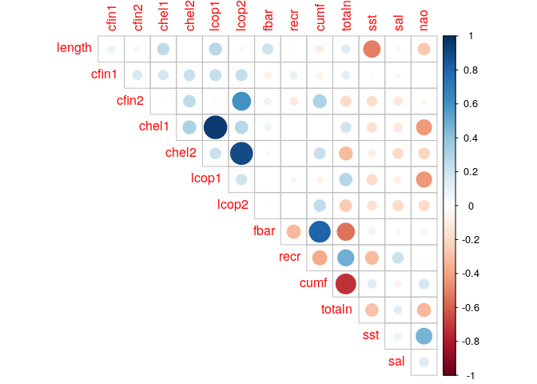
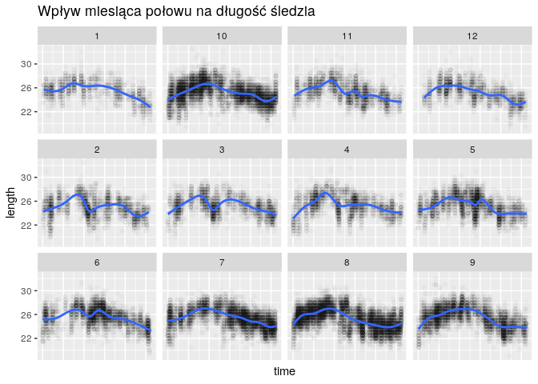
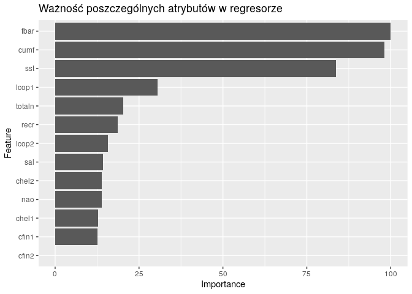
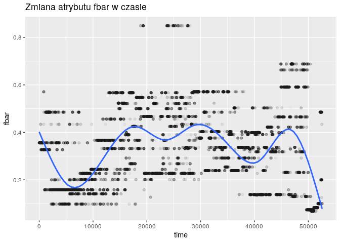
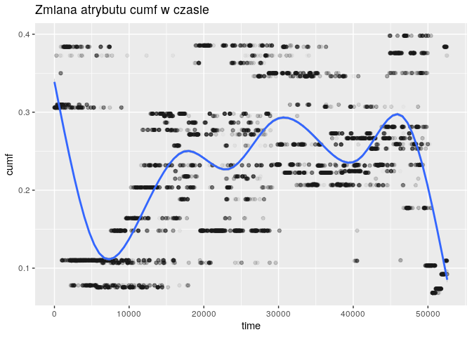
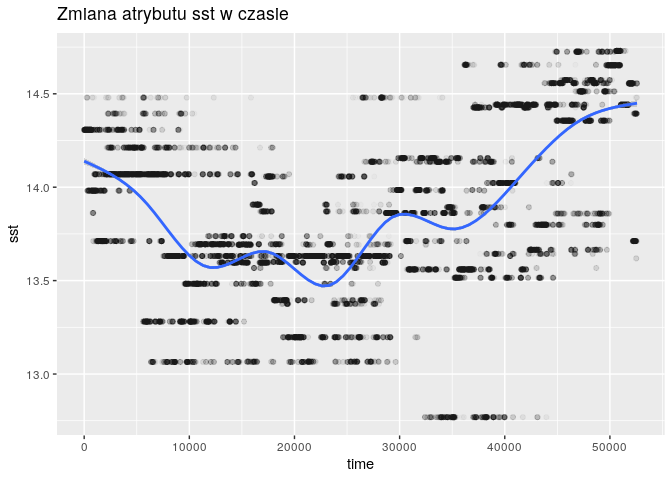

-   [Opis problemu](#opis-problemu)
-   [Podsumowanie analizy](#podsumowanie-analizy)
-   [Wprowadzenie](#wprowadzenie)
    -   [Wykorzystane biblioteki](#wykorzystane-biblioteki)
    -   [Zachowanie powtarzalności
        wyników](#zachowanie-powtarzalności-wyników)
    -   [Wczytanie danych](#wczytanie-danych)
    -   [Podstawowe informacje o zbiorze
        danych](#podstawowe-informacje-o-zbiorze-danych)
    -   [Przygotowanie danych](#przygotowanie-danych)
-   [Grupowanie](#grupowanie)
    -   [Grupowanie globalne](#grupowanie-globalne)
    -   [Grupowanie lokalne](#grupowanie-lokalne)
    -   [Zmiana wyglądu wykresu długości
        śledzia](#zmiana-wyglądu-wykresu-długości-śledzia)
-   [Analiza cech](#analiza-cech)
    -   [Wykresy pudełkowe atrybutów
        numerycznych](#wykresy-pudełkowe-atrybutów-numerycznych)
    -   [Korelacja atrybutów
        numerycznych](#korelacja-atrybutów-numerycznych)
    -   [Wpływ miesiąca na długość
        śledzia](#wpływ-miesiąca-na-długość-śledzia)
-   [Szukanie modelu](#szukanie-modelu)
    -   [Podział zbioru na treningowy i
        uczący](#podział-zbioru-na-treningowy-i-uczący)
    -   [Regresja](#regresja)
-   [Trenowanie modelu](#trenowanie-modelu)
-   [Ocena modelu](#ocena-modelu)
    -   [Analiza ważności atrybutów w
        modelu](#analiza-ważności-atrybutów-w-modelu)

Opis problemu
-------------

Na przestrzeni ostatnich lat zauważono stopniowy spadek rozmiaru śledzia
oceanicznego wyławianego w Europie. Do analizy zebrano pomiary śledzi i
warunków w jakich żyją z ostatnich 60 lat. Dane były pobierane z połowów
komercyjnych jednostek. W ramach połowu jednej jednostki losowo
wybierano od 50 do 100 sztuk trzyletnich śledzi.

Podsumowanie analizy
--------------------

Po przeanalizowaniu danych dochodzimy do wniosku, że wzrost natężenia
połowów oraz wzrost temperatury wody mają wpływ na spadek rozmiaru
śledzia oceanicznego wyławianego w Europie. Spadek rozmiaru nie jest
jednak niepokojący, ponieważ jego wartość z końcowego okresu pomiarów
jest zbliżona do wartości początkowych. Ponadto, wyniki obarczone są
dość dużą niedokładnością z uwagi na szum w danych – podejrzanie podobne
wartości atrybutów oraz brakujące wartości. Możliwe, że zbiór danych z
mniejszą liczbą szumu pozwoliłby na dokładniejszą analizę i wykazanie
mocniejszego związku między natężeniami połowów i temperaturą a
rozmiarem śledzi.

Wprowadzenie
------------

### Wykorzystane biblioteki

    library(dplyr)
    library(ggplot2)
    library(corrplot)
    library(plotly)
    library(caret)
    library(tidyr)

### Zachowanie powtarzalności wyników

    set.seed(0)

### Wczytanie danych

    download.file("http://www.cs.put.poznan.pl/alabijak/emd/projekt/sledzie.csv", "sledzie.csv")
    df <- read.csv(
      "sledzie.csv",
      header=TRUE,
      na.strings="?",
      colClasses=c("xmonth"="factor")
    ) %>%
      rename(time=X)

### Podstawowe informacje o zbiorze danych

    dim(df)

    ## [1] 52582    16

    names(df)

    ##  [1] "time"   "length" "cfin1"  "cfin2"  "chel1"  "chel2"  "lcop1" 
    ##  [8] "lcop2"  "fbar"   "recr"   "cumf"   "totaln" "sst"    "sal"   
    ## [15] "xmonth" "nao"

Wszystkie atrybuty są numeryczne, poza atrybutem xmonth, który jest
kategoryczny. Dane są ułożone chronologicznie i posortowane według
atrybutu time. Jednak nie znamy odstępów między poszczególnymi połowami,
atrybut time zachowuje jedynie porządek w zbiorze.

    summary(df)

    ##       time           length         cfin1             cfin2        
    ##  Min.   :    0   Min.   :19.0   Min.   : 0.0000   Min.   : 0.0000  
    ##  1st Qu.:13145   1st Qu.:24.0   1st Qu.: 0.0000   1st Qu.: 0.2778  
    ##  Median :26290   Median :25.5   Median : 0.1111   Median : 0.7012  
    ##  Mean   :26290   Mean   :25.3   Mean   : 0.4458   Mean   : 2.0248  
    ##  3rd Qu.:39436   3rd Qu.:26.5   3rd Qu.: 0.3333   3rd Qu.: 1.7936  
    ##  Max.   :52581   Max.   :32.5   Max.   :37.6667   Max.   :19.3958  
    ##                                 NA's   :1581      NA's   :1536     
    ##      chel1            chel2            lcop1              lcop2       
    ##  Min.   : 0.000   Min.   : 5.238   Min.   :  0.3074   Min.   : 7.849  
    ##  1st Qu.: 2.469   1st Qu.:13.427   1st Qu.:  2.5479   1st Qu.:17.808  
    ##  Median : 5.750   Median :21.673   Median :  7.0000   Median :24.859  
    ##  Mean   :10.006   Mean   :21.221   Mean   : 12.8108   Mean   :28.419  
    ##  3rd Qu.:11.500   3rd Qu.:27.193   3rd Qu.: 21.2315   3rd Qu.:37.232  
    ##  Max.   :75.000   Max.   :57.706   Max.   :115.5833   Max.   :68.736  
    ##  NA's   :1555     NA's   :1556     NA's   :1653       NA's   :1591    
    ##       fbar             recr              cumf             totaln       
    ##  Min.   :0.0680   Min.   : 140515   Min.   :0.06833   Min.   : 144137  
    ##  1st Qu.:0.2270   1st Qu.: 360061   1st Qu.:0.14809   1st Qu.: 306068  
    ##  Median :0.3320   Median : 421391   Median :0.23191   Median : 539558  
    ##  Mean   :0.3304   Mean   : 520366   Mean   :0.22981   Mean   : 514973  
    ##  3rd Qu.:0.4560   3rd Qu.: 724151   3rd Qu.:0.29803   3rd Qu.: 730351  
    ##  Max.   :0.8490   Max.   :1565890   Max.   :0.39801   Max.   :1015595  
    ##                                                                        
    ##       sst             sal            xmonth           nao          
    ##  Min.   :12.77   Min.   :35.40   8      : 9920   Min.   :-4.89000  
    ##  1st Qu.:13.60   1st Qu.:35.51   10     : 7972   1st Qu.:-1.89000  
    ##  Median :13.86   Median :35.51   7      : 6922   Median : 0.20000  
    ##  Mean   :13.87   Mean   :35.51   9      : 5714   Mean   :-0.09236  
    ##  3rd Qu.:14.16   3rd Qu.:35.52   6      : 4218   3rd Qu.: 1.63000  
    ##  Max.   :14.73   Max.   :35.61   5      : 3736   Max.   : 5.08000  
    ##  NA's   :1584                    (Other):14100

Sąsiednie wiersze mają często jednakowe atrybuty. Ma to uzasadnienie w
tym, że było wiele pomiarów z jednego połowu, a poszczególne ryby różnią
się długością.

    knitr::kable(head(df, 10), caption = "Table with kable")

<table>
<caption>Table with kable</caption>
<thead>
<tr class="header">
<th style="text-align: right;">time</th>
<th style="text-align: right;">length</th>
<th style="text-align: right;">cfin1</th>
<th style="text-align: right;">cfin2</th>
<th style="text-align: right;">chel1</th>
<th style="text-align: right;">chel2</th>
<th style="text-align: right;">lcop1</th>
<th style="text-align: right;">lcop2</th>
<th style="text-align: right;">fbar</th>
<th style="text-align: right;">recr</th>
<th style="text-align: right;">cumf</th>
<th style="text-align: right;">totaln</th>
<th style="text-align: right;">sst</th>
<th style="text-align: right;">sal</th>
<th style="text-align: left;">xmonth</th>
<th style="text-align: right;">nao</th>
</tr>
</thead>
<tbody>
<tr class="odd">
<td style="text-align: right;">0</td>
<td style="text-align: right;">23.0</td>
<td style="text-align: right;">0.02778</td>
<td style="text-align: right;">0.27785</td>
<td style="text-align: right;">2.46875</td>
<td style="text-align: right;">NA</td>
<td style="text-align: right;">2.54787</td>
<td style="text-align: right;">26.35881</td>
<td style="text-align: right;">0.356</td>
<td style="text-align: right;">482831</td>
<td style="text-align: right;">0.3059879</td>
<td style="text-align: right;">267380.8</td>
<td style="text-align: right;">14.30693</td>
<td style="text-align: right;">35.51234</td>
<td style="text-align: left;">7</td>
<td style="text-align: right;">2.8</td>
</tr>
<tr class="even">
<td style="text-align: right;">1</td>
<td style="text-align: right;">22.5</td>
<td style="text-align: right;">0.02778</td>
<td style="text-align: right;">0.27785</td>
<td style="text-align: right;">2.46875</td>
<td style="text-align: right;">21.43548</td>
<td style="text-align: right;">2.54787</td>
<td style="text-align: right;">26.35881</td>
<td style="text-align: right;">0.356</td>
<td style="text-align: right;">482831</td>
<td style="text-align: right;">0.3059879</td>
<td style="text-align: right;">267380.8</td>
<td style="text-align: right;">14.30693</td>
<td style="text-align: right;">35.51234</td>
<td style="text-align: left;">7</td>
<td style="text-align: right;">2.8</td>
</tr>
<tr class="odd">
<td style="text-align: right;">2</td>
<td style="text-align: right;">25.0</td>
<td style="text-align: right;">0.02778</td>
<td style="text-align: right;">0.27785</td>
<td style="text-align: right;">2.46875</td>
<td style="text-align: right;">21.43548</td>
<td style="text-align: right;">2.54787</td>
<td style="text-align: right;">26.35881</td>
<td style="text-align: right;">0.356</td>
<td style="text-align: right;">482831</td>
<td style="text-align: right;">0.3059879</td>
<td style="text-align: right;">267380.8</td>
<td style="text-align: right;">14.30693</td>
<td style="text-align: right;">35.51234</td>
<td style="text-align: left;">7</td>
<td style="text-align: right;">2.8</td>
</tr>
<tr class="even">
<td style="text-align: right;">3</td>
<td style="text-align: right;">25.5</td>
<td style="text-align: right;">0.02778</td>
<td style="text-align: right;">0.27785</td>
<td style="text-align: right;">2.46875</td>
<td style="text-align: right;">21.43548</td>
<td style="text-align: right;">2.54787</td>
<td style="text-align: right;">26.35881</td>
<td style="text-align: right;">0.356</td>
<td style="text-align: right;">482831</td>
<td style="text-align: right;">0.3059879</td>
<td style="text-align: right;">267380.8</td>
<td style="text-align: right;">14.30693</td>
<td style="text-align: right;">35.51234</td>
<td style="text-align: left;">7</td>
<td style="text-align: right;">2.8</td>
</tr>
<tr class="odd">
<td style="text-align: right;">4</td>
<td style="text-align: right;">24.0</td>
<td style="text-align: right;">0.02778</td>
<td style="text-align: right;">0.27785</td>
<td style="text-align: right;">2.46875</td>
<td style="text-align: right;">21.43548</td>
<td style="text-align: right;">2.54787</td>
<td style="text-align: right;">26.35881</td>
<td style="text-align: right;">0.356</td>
<td style="text-align: right;">482831</td>
<td style="text-align: right;">0.3059879</td>
<td style="text-align: right;">267380.8</td>
<td style="text-align: right;">14.30693</td>
<td style="text-align: right;">35.51234</td>
<td style="text-align: left;">7</td>
<td style="text-align: right;">2.8</td>
</tr>
<tr class="even">
<td style="text-align: right;">5</td>
<td style="text-align: right;">22.0</td>
<td style="text-align: right;">0.02778</td>
<td style="text-align: right;">0.27785</td>
<td style="text-align: right;">2.46875</td>
<td style="text-align: right;">21.43548</td>
<td style="text-align: right;">2.54787</td>
<td style="text-align: right;">NA</td>
<td style="text-align: right;">0.356</td>
<td style="text-align: right;">482831</td>
<td style="text-align: right;">0.3059879</td>
<td style="text-align: right;">267380.8</td>
<td style="text-align: right;">14.30693</td>
<td style="text-align: right;">35.51234</td>
<td style="text-align: left;">7</td>
<td style="text-align: right;">2.8</td>
</tr>
<tr class="odd">
<td style="text-align: right;">6</td>
<td style="text-align: right;">24.0</td>
<td style="text-align: right;">0.02778</td>
<td style="text-align: right;">0.27785</td>
<td style="text-align: right;">2.46875</td>
<td style="text-align: right;">21.43548</td>
<td style="text-align: right;">2.54787</td>
<td style="text-align: right;">26.35881</td>
<td style="text-align: right;">0.356</td>
<td style="text-align: right;">482831</td>
<td style="text-align: right;">0.3059879</td>
<td style="text-align: right;">267380.8</td>
<td style="text-align: right;">14.30693</td>
<td style="text-align: right;">35.51234</td>
<td style="text-align: left;">7</td>
<td style="text-align: right;">2.8</td>
</tr>
<tr class="even">
<td style="text-align: right;">7</td>
<td style="text-align: right;">23.5</td>
<td style="text-align: right;">0.02778</td>
<td style="text-align: right;">0.27785</td>
<td style="text-align: right;">2.46875</td>
<td style="text-align: right;">21.43548</td>
<td style="text-align: right;">2.54787</td>
<td style="text-align: right;">26.35881</td>
<td style="text-align: right;">0.356</td>
<td style="text-align: right;">482831</td>
<td style="text-align: right;">0.3059879</td>
<td style="text-align: right;">267380.8</td>
<td style="text-align: right;">14.30693</td>
<td style="text-align: right;">35.51234</td>
<td style="text-align: left;">7</td>
<td style="text-align: right;">2.8</td>
</tr>
<tr class="odd">
<td style="text-align: right;">8</td>
<td style="text-align: right;">22.5</td>
<td style="text-align: right;">0.02778</td>
<td style="text-align: right;">0.27785</td>
<td style="text-align: right;">2.46875</td>
<td style="text-align: right;">21.43548</td>
<td style="text-align: right;">2.54787</td>
<td style="text-align: right;">26.35881</td>
<td style="text-align: right;">0.356</td>
<td style="text-align: right;">482831</td>
<td style="text-align: right;">0.3059879</td>
<td style="text-align: right;">267380.8</td>
<td style="text-align: right;">14.30693</td>
<td style="text-align: right;">35.51234</td>
<td style="text-align: left;">7</td>
<td style="text-align: right;">2.8</td>
</tr>
<tr class="even">
<td style="text-align: right;">9</td>
<td style="text-align: right;">22.5</td>
<td style="text-align: right;">0.02778</td>
<td style="text-align: right;">0.27785</td>
<td style="text-align: right;">2.46875</td>
<td style="text-align: right;">21.43548</td>
<td style="text-align: right;">2.54787</td>
<td style="text-align: right;">26.35881</td>
<td style="text-align: right;">0.356</td>
<td style="text-align: right;">482831</td>
<td style="text-align: right;">0.3059879</td>
<td style="text-align: right;">267380.8</td>
<td style="text-align: right;">14.30693</td>
<td style="text-align: right;">35.51234</td>
<td style="text-align: left;">7</td>
<td style="text-align: right;">2.8</td>
</tr>
</tbody>
</table>

### Przygotowanie danych

Do dalszej analizy odfiltrowujemy wiersze z niepełnymi danymi. To około
20% danych. Pozostałe 42,000 powinny wystarczyć do dalszej analizy.
Dodatkowo przygotowujemy dane wyłącznie numeryczne do analizy korelacji
atrybutów.

    df_numeric <- subset(df, select=-c(time, xmonth))
    df_numeric_without_na <- df_numeric[complete.cases(df_numeric),]
    df_without_na <- df[complete.cases(df),]
    dim(df_without_na)

    ## [1] 42488    16

Grupowanie
----------

Po spojrzeniu na dane oraz krótkim zastanowieniu doszliśmy do wniosku,
że nie powinniśmy przewidywać długości pojedynczego śledzia, a jego
średnią długość. Bez grupowania danych te same zestawy atrybutów
zwracają różne długości śledzia, co jest zjawiskiem nieporządanym w
algorytmach uczenia maszynowego. Z uwagi na brak atrybutu opisującego
dokładny czas, musimy pogrupować przykłady na podstawie wartości
pozostałych atrybutów.

### Grupowanie globalne

Najpierw spróbowaliśmy pogrupować przykłady z użyciem metody group\_by.
Ku naszemu zdziwieniu okazało się, że przykłady znacznie oddalone od
siebie w zbiorze danych mają dokładnie te same wartości atrybutów.
Według nas jest to zbyt mało prawdopodobne i oznacza występowanie błędów
w zbiorze danych.

    df_grouped_globally <- df_without_na %>%
      group_by(cfin1, cfin2, chel1, chel2, cumf, lcop1, lcop2, fbar, recr, totaln, sst, sal, nao) %>%
      summarise(
        avg_length = mean(length),
        min_time = min(time),
        max_time = max(time)
      )
    dim(df_grouped_globally)

    ## [1] 106  16

    df_grouped_globally <- df_grouped_globally %>% ungroup() %>% select(min_time, max_time, avg_length) %>% arrange(min_time)
    head(df_grouped_globally)

    ## # A tibble: 6 x 3
    ##   min_time max_time avg_length
    ##      <int>    <int>      <dbl>
    ## 1        1     9143       23.0
    ## 2      221    52580       24.1
    ## 3      290    40730       25.8
    ## 4      781    38018       26.2
    ## 5      864    52579       25.5
    ## 6      975     4366       25.3

    df_without_na %>% filter(time == 1)

    ##   time length   cfin1   cfin2   chel1    chel2   lcop1    lcop2  fbar
    ## 1    1   22.5 0.02778 0.27785 2.46875 21.43548 2.54787 26.35881 0.356
    ##     recr      cumf   totaln      sst      sal xmonth nao
    ## 1 482831 0.3059879 267380.8 14.30693 35.51234      7 2.8

    df_without_na %>% filter(time == 9143)

    ##   time length   cfin1   cfin2   chel1    chel2   lcop1    lcop2  fbar
    ## 1 9143     21 0.02778 0.27785 2.46875 21.43548 2.54787 26.35881 0.356
    ##     recr      cumf   totaln      sst      sal xmonth nao
    ## 1 482831 0.3059879 267380.8 14.30693 35.51234      4 2.8

### Grupowanie lokalne

Drugim podejściem grupowania było złączenie przykładów, które mają te
same wartości atrybutów oraz występują obok siebie. Takie grupowanie
wydaje się poprawne. Długości śledzi w grupach zostały uśrednione. Po
takim grupowaniu zostało nam 2558 przykładów.

    df_grouped <- df_numeric_without_na[FALSE,]
    last_group_lengths <- vector()
    last_row <- NULL
    regression_col_names <- c("cfin1", "cfin2", "chel1", "chel2", "cumf", "lcop1", "lcop2", "fbar", "recr", "totaln", "sst", "sal", "nao")
    for (row_i in 1:nrow(df_without_na)) {
      row <- df_numeric_without_na[row_i,]
      if (is.null(last_row) || all(last_row[regression_col_names] == row[regression_col_names])) {
      } else {
        last_row$length <- mean(last_group_lengths)
        df_grouped[nrow(df_grouped) + 1,] <- last_row
        last_group_lengths <- vector()
      }
      last_group_lengths <- c(last_group_lengths, row$length)
      last_row <- row
    }
    if (length(last_group_lengths) > 0) {
      last_row$length <- mean(last_group_lengths)
      df_grouped[nrow(df_grouped) + 1,] <- last_row
    }
    dim(df_numeric_without_na)

    ## [1] 42488    14

    dim(df_grouped)

    ## [1] 2558   14

### Zmiana wyglądu wykresu długości śledzia

Grupowanie danych sprawiło, że wykres zmienności długości śledzi wygląda
“lepiej”. Punkty pomiarowe są bliżej linii trendu i nie występuje już
tak silna dyskretyzacja wartości długości.

    qplot(
        1:nrow(df),
        df$length
      ) +
      geom_point(alpha = 0.02) +
      geom_smooth() +
      xlab("czas") +
      ylab("długość śledzia") +
      ggtitle("Długość śledzia w oryginalnym zbiorze danych")

    qplot(
        1:nrow(df_grouped),
        df_grouped$length
      ) +
      geom_point(alpha = 0.2) +
      geom_smooth() +
      xlab("time") +
      ylab("długość śledzia") +
      ggtitle("Długość śledzia na pogrupowanych danych")

Analiza cech
------------

Następnym etapem analizy jest przyjrzenie się rozkładom wartości
poszczególnych atrybutów. Dokonaliśmy tego z użyciem wykresów
pudełkowych.

### Wykresy pudełkowe atrybutów numerycznych

    df_grouped %>%
      gather() %>%
      ggplot(aes(y=value)) +
        facet_wrap(~ key, scales="free") +
        geom_boxplot() +
        labs(title = "Rozkłady wartości atrybutów numerycznych")

Na niektórych wykresach występuje stosunkowo sporo wartości odstających.
Widać również spore różnice w wielkościach atrybutów, co sugeruje nam
potrzebę przeskalowania ich w późniejszym etapie zadania, podczas
tworzenia modelu regresji.

### Korelacja atrybutów numerycznych

Wykresy korelacji atrybutów pokazuje kilka silnych zależności. Warto
wyróżnić tutaj pary: chel1-lcop1, chel2-lcop2 oraz cumf-totaln. Pierwsze
dwie pary to różne gatunki planktonu, występowanie jednego gatunku
potencjalnie wpływa na rzadsze występowanie drugiego (korelacja bliska
-1). Z kolei para cumf-totaln to natężenie połowów i łączna liczba
złowionych ryb, ich pozytywna korelacja nie powinna zaskakiwać.

    corrplot(
      cor(df_grouped),
      method="circle",
      type="upper",
      diag=FALSE
    )

### Wpływ miesiąca na długość śledzia

Postanowiliśmy również sprawdzić czy miesiąc znacząco wpływa na długość
śledzi. Okazało się, że miesiąc nie ma zbyt dużego wpływu i można go
pominąć w dalszej analizie. Dodatkowo, z uwagi na to, że miesiąc nie
jest wartością liczbową, sprawiałby on problemy w niektórych modelach
regresji.

    ggplot(
        df,
        aes(x=time, y=length)
      ) +
      facet_wrap(~xmonth) +
      geom_point(alpha = 0.02) +
      geom_smooth() +
      labs(title = "Wpływ miesiąca połowu na długość śledzia") +
      theme(
        axis.text.x = element_blank(),
        axis.ticks.x = element_blank()
      )

Szukanie modelu
---------------

### Podział zbioru na treningowy i uczący

Przed trenowanie modelu należy podzielić zbiór danych na zbiór
treningowy i uczący. W naszym przypadku podzieliliśmy je w stosunku 1 do
3.

    inTraining <- createDataPartition(
      y = df_grouped$length,
      p = .75,
      list = FALSE
    )

    train_set <- df_grouped[inTraining,]
    test_set <- df_grouped[-inTraining,]

    dim(train_set)

    ## [1] 1920   14

    dim(test_set)

    ## [1] 638  14

### Regresja

Trenowanie modelu
-----------------

Do znalezienia regresora długości śledzi posługujemy się algorytmem
regresji liniowej. Podczas uczenia używamy techniki walidacji krzyżowej
z podziałem zbioru treningowego na 10 części.

    fitControl <- trainControl(
      method = "repeatedcv",
      number = 10,
      repeats = 10
    )
    model_cv <- train(
      length ~ .,
      data = as.matrix(train_set),
      method = "lm",
      na.action = na.omit,
      trControl = fitControl,
      preProcess = c("scale", "center")
    )
    model_cv

    ## Linear Regression 
    ## 
    ## 1920 samples
    ##   13 predictor
    ## 
    ## Pre-processing: scaled (13), centered (13) 
    ## Resampling: Cross-Validated (10 fold, repeated 10 times) 
    ## Summary of sample sizes: 1728, 1728, 1729, 1727, 1729, 1727, ... 
    ## Resampling results:
    ## 
    ##   RMSE      Rsquared   MAE      
    ##   1.027292  0.4350031  0.7892772
    ## 
    ## Tuning parameter 'intercept' was held constant at a value of TRUE

Ocena modelu
------------

Za baseline uznaliśmy regresor, który zawsze zwraca średnią długość
śledzia policzoną na wszystkich obserwacjach ze zbioru uczącego.
Nauczony regresor jest znacząco lepszy niż baseline, co widać po
wartościach RMSE. Niestesty nie udało nam się zrozumieć dlaczego
Rsquared ma wartość NA w przypadku baseline’u.

    test_pred <- predict(model_cv, test_set)
    dim(test_set)

    ## [1] 638  14

    postResample(pred = test_pred, obs = test_set$length)

    ##      RMSE  Rsquared       MAE 
    ## 0.9877959 0.4271115 0.7684870

    postResample(pred = mean(train_set$length), obs = test_set$length)

    ##     RMSE Rsquared      MAE 
    ## 1.302938       NA 1.040531

### Analiza ważności atrybutów w modelu

Spojrzenie na ważność cech w regresorze może pomóc nam w zrozumieniu
występowania zjawiska stopniowego spadku rozmiaru śledzia. Dwa
najbardziej znaczące atrybuty to natężenia połowów w regionie, wyrażone
w ułamku pozostawionego narybku. Trzecim znaczącym atrybutem jest sst,
czyli temperatura przy powierzchni wody.

    ggplot(varImp(model_cv)) +
      ggtitle("Ważność poszczególnych atrybutów w regresorze")

    for (col in c("fbar", "cumf", "sst")) {
      plt <- ggplot(
        df,
        aes_string(x="time", y=col)
      ) +
        geom_point(alpha = 0.02) +
        geom_smooth() +
        ggtitle(paste("Zmiana atrybutu", col, "w czasie"))
      print(plt)
    }

